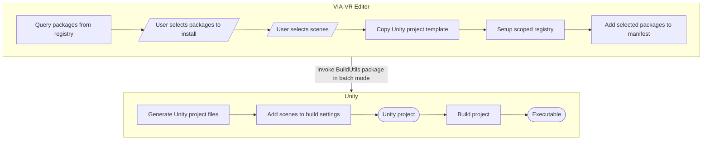

# Build System

The build system creates a Unity project based on the VIA-VR project and invokes the Unity build process to generate an executable application.

## Build Process Flowchart



<!-- TODO: add specification how packages load configuration form the VIA-VR editor, how behaviors are added to scenes, etc -->

## BuildUtils Package [Outdated]

- The build utils must provide the method `de.jmu.ge.BuildUtils.BuildManager.BuildToDefaultPath`, which builds the executable
- The build utils must provide the method `de.jmu.ge.BuildUtils.SceneImporter.AddScenesToBuildSettings`, which reads the file `Assets/Settings/scenes.txt`. This file lists all scenes that should be considered for the executable, one per line, including the path relative to the `Assets` directory. For example:

```txt
 Assets/Scenes/SampleScene.unity
 Assets/Scenes/SampleScene2.unity
```

## Scene Export Pipeline


