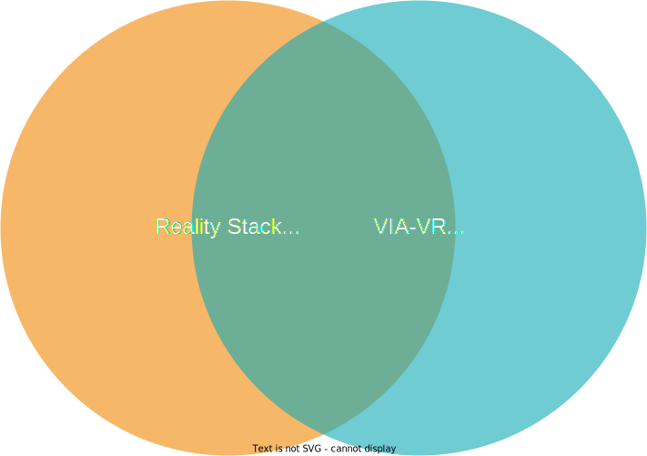

# Reality Stack and VIA-VR Packages

This page explains the relationship between VIA-VR packages and [Reality Stack](https://gitlab2.informatik.uni-wuerzburg.de/hci/development/reality-stack/reality-stack-orga/-/wikis/home) packages.

The Reality Stack is a collection of Unity packages published under common branding and license. Unity packages are considered VIA-VR packages if they are compatible with VIA-VR. Please read [How to Create Packages for VIA-VR](QuickStart.html) to learn how to configure packages for VIA-VR. Any Reality Stack package that is compatible with VIA-VR can be considered a VIA-VR package. At the same time, any package that was specifically created for VIA-VR and published as part of the Reality Stack is a Reality Stack package.
There are Reality Stack packages that are incompatible with VIA-VR. Likewise, there are highly specific VIA-VR packages, that are not part of the Reality Stack. A complete congruence of both sets of packages is neither feasible nor desired.
